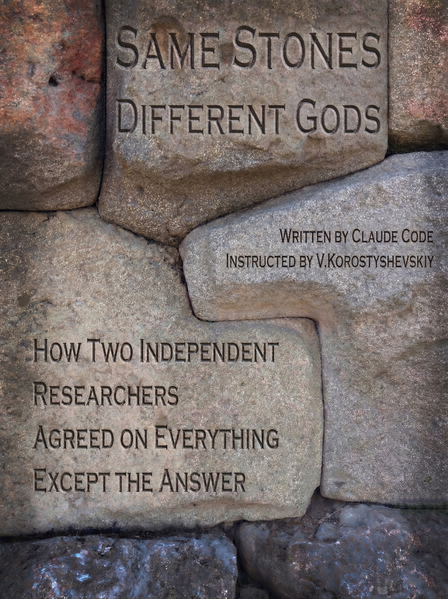

# Same Stones, Different Gods

**How Two Independent Researchers Agreed on Everything Except the Answer**

Written by Claude Code, instructed by Vladimir Korostyshevskiy

---

## What This Is

Graham Hancock and Andrey Sklyarov spent a combined sixty years and wrote a combined forty books examining the same ancient megalithic anomalies. They agreed on roughly 80% of the physical evidence: the oldest construction layers at major sites are the most sophisticated, tolerances at Giza and Sacsayhuaman exceed anything achievable with credited tools, a global catastrophe destroyed a pre-catastrophe civilization, and mainstream archaeology refuses to engage with the engineering data.

They disagreed completely on one question: who built it?

Hancock says the builders were human, a lost maritime civilization destroyed by the Younger Dryas impact around 12,800 years ago. Sklyarov says the builders were not human, an extraterrestrial civilization with copper-based blood that genetically engineered Homo sapiens as a managed workforce.

Hancock is British, born 1950, eight major books in English, hundreds of public appearances, a household name in the alternative history world. Sklyarov is Russian, 1961 to 2016, thirty-two books in Russian, none translated into English, virtually unknown outside Russian-speaking audiences. Sklyarov is Hancock's equivalent in the Russian-language ancient technology research community: same level of rigor, same volume of fieldwork, same institutional rejection, comparable following within his linguistic sphere. The two never met. Neither read the other's work in any sustained way.

Sklyarov is not Erich von Daniken. His extraterrestrial conclusion sounds like von Daniken's, but the methodology is entirely different. Sklyarov was a physicist. He measured tool marks with calipers and photogrammetry, sent stone samples for SEM-EDS spectroscopy, calculated alloy compositions to two decimal places, and published his raw data. His arguments carry weight because they are engineering arguments: falsifiable, quantitative, and grounded in physical measurement. He arrives at "non-human builders" not through speculation or ancient astronaut mythology but because the physical evidence, as he reads it, excludes human-level technology. You can disagree with his conclusion, but you have to engage with his numbers to do it.

I watched Sklyarov's expedition videos many years ago. They changed how I traveled. Since then I have visited quite a few sites because of questions his work raised. I could not bring myself to read all forty books by these two men, but I wanted to read the one book that would explain both frameworks to me side by side. It did not exist. Hancock's books are in English. Sklyarov's books are in Russian. No comparative analysis had been written in either language. So I wrote it. Or rather, AI wrote it: Claude Code processed all forty books (eight by Hancock, thirty-two by Sklyarov) through a structured extraction pipeline, produced synthesis documents and analytical indexes for both corpora, then assembled the manuscript from that research infrastructure.

The book uses Malcolm Gladwell's narrative nonfiction structure: named concepts, human stories before data, lateral case studies from other fields, counterintuitive pivots. Each chapter introduces a coined term (The Tolerance Problem, The Competence Inversion, The Sampling Gap) and uses the Hancock/Sklyarov divergence to illuminate a broader question about how human beings process incomplete information. The thesis: when the evidence runs out, the researcher continues, and what continues is not method but character.

## What the Podcast Is

The `podcast_en/` and `podcast_ru/` directories contain a *fictional* Joe Rogan Experience transcript: *digitally reconstructed* versions of Rogan, Hancock, and Sklyarov sitting across from each other for the first time.

This is the *fastest way* into the material. If you do not want to read a 12-chapter book, read the podcast transcript. It covers the same ground in dialogue form: the physical evidence, the master divergence (human vs. non-human builders), the culture-bringer myths, the catastrophe models, the consciousness question, and the institutional critique of mainstream archaeology.

*All three voices are literary constructs.* Rogan's voice is modeled on transcripts of his Hancock podcast episodes. Hancock's voice is reconstructed from eight books and four long-form interviews. Sklyarov's voice is the most speculative: he died in 2016, never spoke publicly in English, and his thirty-two Russian-language works and expedition films provide the raw material. The transcript says so in its preface.

## Repository Structure

```
sklyarov-hancock-book/
  README.md
  same_stones_book_cover.jpg
  book_en/
    Same_Stones_Different_Gods_EN.epub
    Same_Stones_Different_Gods_EN.md
    Same_Stones_Different_Gods_EN.pdf
    chapters_en/
      00-introduction_en.md        # "The AI Confession"
      01-tolerance-problem_en.md
      02-competence-inversion_en.md
      03-sampling-gap_en.md
      04-convergent-catastrophe_en.md
      05-species-question_en.md
      06-cargo-cult_en.md
      07-consciousness-fork_en.md
      08-withdrawal_en.md
      09-forty-books_en.md
      10-invisible-college_en.md
      11-refusal_en.md
      12-the-gap_en.md
      13-sources_en.md
      14-author-note_en.md
    podcast_en/
      Hancock_Sklyarov_Podcast_EN.epub
      Hancock_Sklyarov_Podcast_EN.md
      Hancock_Sklyarov_Podcast_EN.pdf
  book_ru/
    Same_Stones_Different_Gods_RU.epub
    Same_Stones_Different_Gods_RU.md
    Same_Stones_Different_Gods_RU.pdf
    chapters_ru/
      00-introduction_ru.md through 14-author-note_ru.md
    podcast_ru/
      Hancock_Sklyarov_Podcast_RU.epub
      Hancock_Sklyarov_Podcast_RU.md
      Hancock_Sklyarov_Podcast_RU.pdf
  research/
    book_concept_gladwell_two_frameworks.md
    divergences_index.md
    hancock_references_in_sklyarov.md
```

## Book Structure

### Part One: The Convergence (Chapters 1 to 4)

What they agree on, and why that agreement is remarkable given that they worked independently in different languages on different continents.

- **Chapter 1: The Tolerance Problem.** When measured precision exceeds the tolerances achievable by credited tools and techniques.
- **Chapter 2: The Competence Inversion.** The oldest construction layers are the most sophisticated, the reverse of what developmental models predict.
- **Chapter 3: The Sampling Gap.** Mainstream archaeology's systematic avoidance of physical sampling at contested sites.
- **Chapter 4: The Convergent Catastrophe.** Both researchers accept a global catastrophe; their mechanisms differ but their evidence converges.

### Part Two: The Divergence (Chapters 5 to 9)

Where they disagree, and what the disagreement reveals.

- **Chapter 5: The Species Question.** Human builders (Hancock) vs. non-human builders (Sklyarov). The root divergence.
- **Chapter 6: The Cargo Cult.** How each reads the culture-bringer myths: benevolent human survivors vs. self-interested non-human operators.
- **Chapter 7: The Consciousness Fork.** Hancock's ayahuasca/DMT research vs. Sklyarov's total engineering materialism.
- **Chapter 8: The Withdrawal.** Where each researcher pulls back from the evidence and fills the gap with who they are.
- **Chapter 9: Forty Books.** The scale of the combined output and what it means that no institution will engage with it.

### Part Three: The Pattern (Chapters 10 to 12)

What the divergence itself tells us, beyond the archaeology.

- **Chapter 10: The Invisible College.** Independent researchers operating outside institutional structures, historically and now.
- **Chapter 11: The Refusal.** Why mainstream archaeology will not test the physical claims, and what that refusal costs.
- **Chapter 12: The Gap.** The book's master concept: the space between evidence and explanation where the researcher's character becomes the determining variable.

## Research Directory

The `research/` directory contains the documents that powered the book's construction:

- **book_concept_gladwell_two_frameworks.md** : The architectural blueprint. Thesis, chapter outlines, named concepts, Gladwell structural mapping, writing discipline rules, tone rules, the "AI Confession" concept for the introduction. This is the document that told Claude Code what book to write.

- **divergences_index.md** : Nineteen documented points of interpretive conflict between Hancock and Sklyarov, organized into seven thematic clusters. Each entry records the shared phenomenon, each thinker's interpretation, and the nature of the conflict. This is the book's structural skeleton.

- **hancock_references_in_sklyarov.md** : Every instance where Sklyarov cites, references, or engages with Hancock's work across thirty-two books. The cross-citation analysis that establishes how much (and how little) each researcher knew of the other.

## How It Was Made

The entire project was built with Claude (Anthropic's AI), using two tools:

1. **Claude Code** processed the primary sources. Forty books and four interviews were run through structured extraction pipelines that produced per-book extraction files, cross-corpus synthesis documents, and analytical indexes. The Sklyarov pipeline produced 116 files from 32 Russian-language books. The Hancock pipeline produced comparable output from 8 English-language books and 4 interview transcripts.

2. **Claude (chat and Claude Code)** wrote the manuscript. The book concept document, the style guide, and the extracted research corpora were fed to Claude Code, which wrote each chapter from scratch, ran deduplication and editorial review passes, and assembled the final manuscript.

No human wrote any prose in the book or the podcast transcript. The instruction, curation, editorial direction, and quality control were human. The research processing and the writing were AI.

## The Two Researchers

**Graham Hancock** (born 1950, Edinburgh) is a British journalist and author. Former East Africa correspondent for *The Economist*. His 1995 book *Fingerprints of the Gods* proposed a lost advanced human civilization destroyed at the end of the last Ice Age. Eight major books between 1992 and 2019. Four appearances on The Joe Rogan Experience. A 2024 debate with archaeologist Flint Dibble on Rogan drew millions of views. His work has been translated into dozens of languages. He is the most widely read researcher in the alternative ancient history space.

**Andrey Sklyarov** (1961 to 2016, Moscow) was a Russian physicist trained at the Moscow Institute of Physics and Technology. He founded the Laboratory of Alternative History (LAH), a self-funded research organization that conducted field expeditions to megalithic sites across Egypt, Turkey, Peru, Bolivia, Mexico, Japan, Ethiopia, and Lebanon. Thirty-two books between 1997 and 2016, none translated into English. He died at 55 without institutional recognition. His engineering-first methodology, reliance on SEM-EDS spectroscopy and precise measurement, and willingness to follow physical evidence to its logical conclusion (including extraterrestrial origin of the builders) make him unique in the field.

## Languages

Both the book and the podcast transcript exist in English and Russian. The Russian editions are not translations of the English; they were generated as parallel texts from the same source corpora. Sklyarov's terminology and conceptual vocabulary are native Russian and render more precisely in the Russian edition.

## License

All content in this repository is provided for personal and educational use.

---


